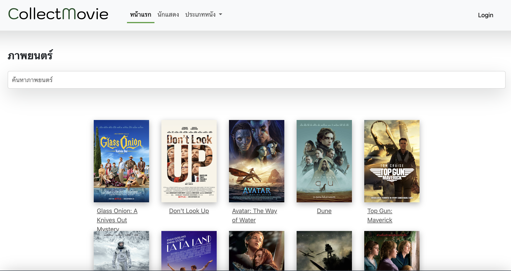
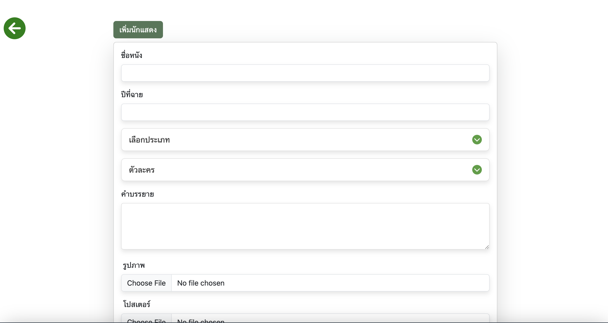
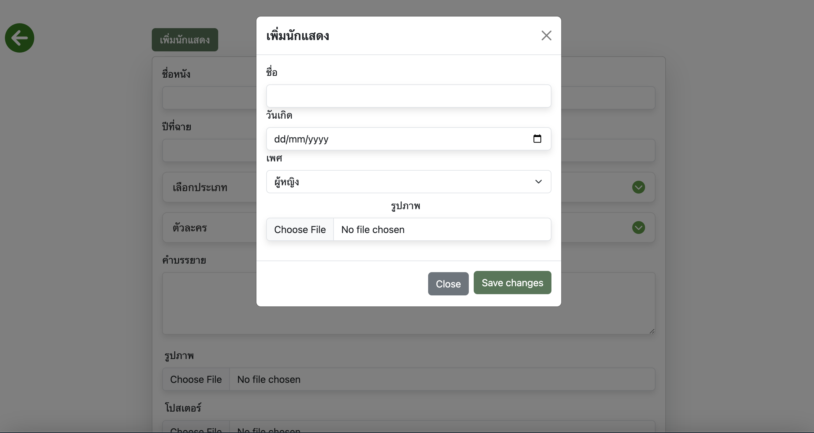
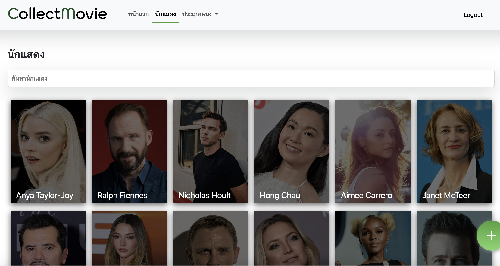
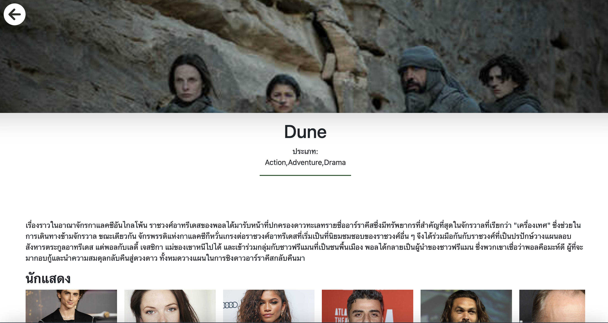
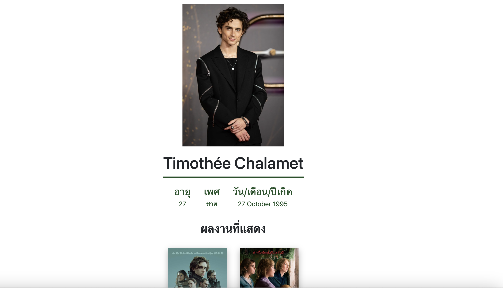

## **Mini Project Collect Movie Using ***Java Spring MVC*** (for education)**
 

### **functionality**
***Admin***
* เข้าสู่ระบบ
* เพิ่ม/ลบ/แก้ไขรายการหนัง
* เพิ่ม/ลบ/แก้ไขนักแสดง

***User***

* ดูรายการหนังแนะนำ
* ค้นหาหนัง
* ค้นหานักแสดงด้วยบทบาท/ชื่อ

## Collaborators

